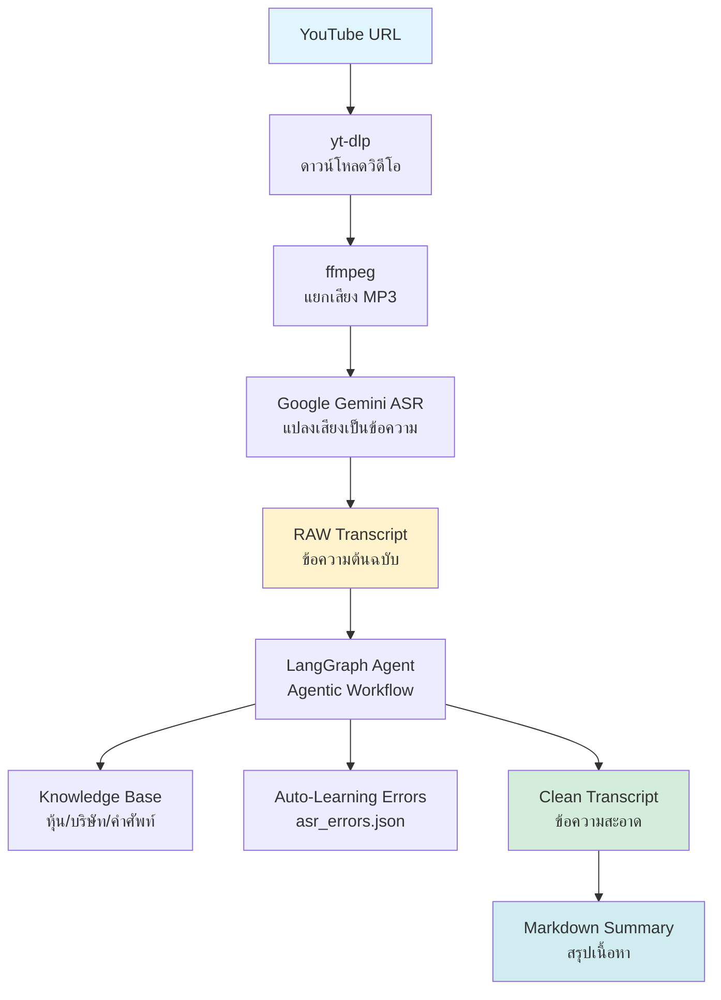
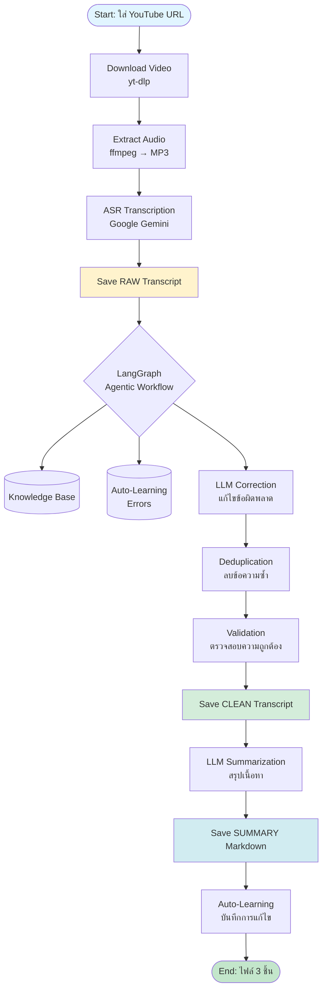
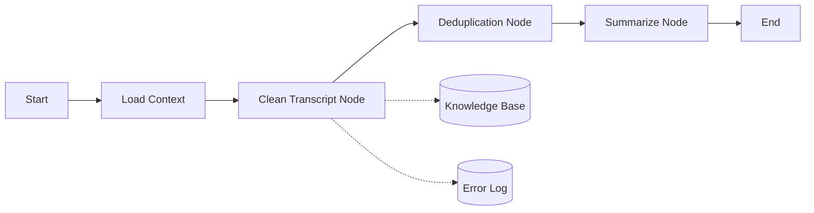
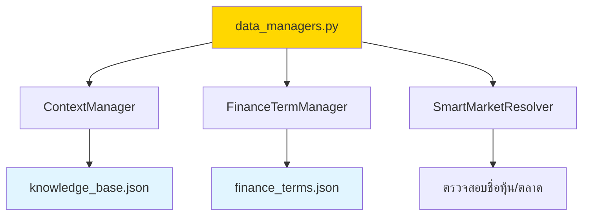
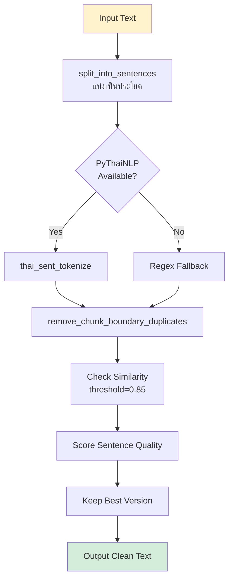
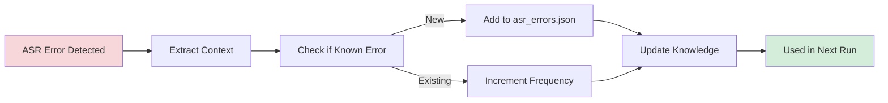
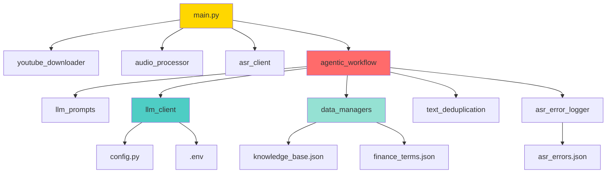

# 📘 ASR Agent Project Overview

> **Thai Financial News Transcription & Enhancement System**  
> เวอร์ชัน 1.3+ | อัปเดตล่าสุด: 2025-12-24

---

## 🎯 Project Vision

ระบบแปลงเสียงเป็นข้อความ (ASR) สำหรับข่าวการเงินภาษาไทย พร้อมการแก้ไขและปรับปรุงคุณภาพโดยใช้ AI Agent

**เป้าหมายหลัก:**
- แปลงคลิป YouTube ข่าวหุ้นเป็น Transcript ที่แม่นยำ
- แก้ไขข้อผิดพลาดจาก ASR โดย LLM
- ลบข้อความซ้ำซ้อน (Deduplication)
- สกัดข้อมูลสำคัญและสรุปเนื้อหา
- เรียนรู้และปรับปรุงตัวเองอัตโนมัติ (Auto-Learning)

---

## 🏗️ System Architecture



---

## 📂 Project Structure

```
asr_agent_ver1_2/
├── main.py                    # 🚀 Entry point หลัก
├── config.py                  # ⚙️ Configuration settings
├── .env                       # 🔐 API Keys & Secrets
│
├── src/
│   ├── agents/               # 🤖 LLM Agents
│   │   ├── llm_prompts.py        # Prompt templates
│   │   └── llm_client.py         # LLM API wrapper
│   │
│   ├── core/                 # 💎 Core Business Logic
│   │   ├── agentic_workflow.py   # LangGraph workflow
│   │   ├── data_managers.py      # Knowledge Base manager
│   │   └── asr_client.py         # Gemini ASR client
│   │
│   └── utils/                # 🛠️ Utility Functions
│       ├── text_deduplication.py # ลบข้อความซ้ำ
│       ├── youtube_downloader.py # ดาวน์โหลด YouTube
│       ├── audio_processor.py    # แปลงไฟล์เสียง
│       ├── asr_error_logger.py   # Auto-learning system
│       └── confidence_parser.py  # Parse [UNSURE] markers
│
├── data/
│   ├── knowledge_base.json   # 📚 ข้อมูลหุ้น/บริษัท
│   ├── finance_terms.json    # 💼 คำศัพท์การเงิน
│   └── asr_errors.json       # 📝 ประวัติการแก้ไข
│
├── transcripts_output/       # 📄 ผลลัพธ์ทั้งหมด
│   ├── *_RAW_*.txt               # ข้อความจาก ASR
│   ├── *_CLEAN_*.txt             # ข้อความหลังแก้ไข
│   └── *_SUMMARY_*.md            # สรุปเนื้อหา
│
└── research_archive/         # 🗂️ โค้ดทดสอบ/วิจัย (เก่า)
```

---

## 🔄 Complete Workflow



---

## 🧩 Core Components

### 1. **main.py** - Entry Point
```python
# หน้าที่หลัก:
1. รับ YouTube URL จาก user
2. ดาวน์โหลดวิดีโอ → แยกเสียง → ASR
3. เรียก LangGraph Agentic Workflow
4. บันทึกผลลัพธ์ (RAW, CLEAN, SUMMARY)
```

**Key Functions:**
- `main()` - Main execution flow
- `process_video()` - Process single video
- `run_agentic_workflow()` - Trigger LangGraph

---

### 2. **src/core/agentic_workflow.py** - Workflow Engine



**Nodes:**
1. **clean_transcript_node** - แก้ไขข้อผิดพลาดด้วย LLM
2. **remove_duplicates_node** - ลบข้อความซ้ำ
3. **summarize_content_node** - สรุปเนื้อหา

**State Management:**
```python
class GraphState(TypedDict):
    raw_transcript: str
    clean_transcript: str
    summary: str
    video_metadata: dict
```

---

### 3. **src/agents/llm_prompts.py** - Prompt Engineering

**3 Prompt Templates:**

#### A. `correction_system_prompt`
```
<role>บรรณาธิการนักวิเคราะห์การลงทุนอาวุโส</role>
<mission>
  🚨 ห้ามสรุป ห้ามลดเนื้อหา ห้ามตัดตอน!
  รักษาข้อมูล 100% (หุ้น/ราคา/ตัวเลข)
</mission>
<workflow>
  1. อ่านและทำความเข้าใจบริบท
  2. ตรวจสอบ Knowledge Base ก่อนเสมอ
  3. ใช้ Contextual Reasoning
  4. Double-Anchoring สำหรับการแก้ไข
</workflow>
```

#### B. `DynamicPromptBuilder`
```python
# สร้าง prompt ตามบริบทวิดีโอ
- Extract title & channel
- Identify stock tickers mentioned
- Build context-aware prompt
```

#### C. `summarization_system_prompt`
```
สรุปเนื้อหาเป็น Markdown
- Structured format
- Bullet points
- Key highlights
```

---

### 4. **src/core/data_managers.py** - Knowledge Management



**Classes:**

#### `ContextManager`
- โหลด `knowledge_base.json`
- Provide stock/company/index data

#### `FinanceTermManager`
- โหลด `finance_terms.json`
- Provide financial terminology

#### `SmartMarketResolver`
- แก้ไขชื่อตลาดที่พูดผิด
- เช่น "เน่า แส็ด แด็ก" → "NASDAQ"

---

### 5. **src/utils/text_deduplication.py** - Deduplication Engine



**Key Features:**
- **PyThaiNLP Integration** - Thai-aware sentence splitting
- **5-Sentence Look-ahead** - ตรวจสอบซ้ำไปข้างหน้า 5 ประโยค
- **Quality Scoring** - เลือกประโยคที่ดีที่สุด
- **Mark & Clean** - LLM mark `[DUP]`, Python removes

---

### 6. **src/utils/asr_error_logger.py** - Auto-Learning System



**asr_errors.json Structure:**
```json
{
  "errors": [
    {
      "raw": "คำผิด",
      "corrected": "คำถูก",
      "context": "บริบทโดยรอบ",
      "frequency": 5,
      "video_ids": ["abc123"]
    }
  ]
}
```

---

## 🔗 Component Dependencies



---

## 🎯 Data Flow Example

**Input:** YouTube URL
```
https://youtube.com/watch?v=xxx
```

**Step 1: Download & Extract**
```
video.mp4 → audio.mp3
```

**Step 2: ASR Transcription**
```
"สวัสดีครับมาพบกับพี่เบรกในส่วนของ เซตเด็กเนี่ย..."
→ Save to: *_RAW_20251224_1653.txt
```

**Step 3: LLM Correction**
```
Input:  "เซตเด็ก"
Check:  Knowledge Base → "SET Index"
Output: "SET Index"
→ Save to: *_CLEAN_20251224_1653.txt
```

**Step 4: Deduplication**
```
Input:  "AMATA ดูแนวต้าน 16.90... AMATA ดูแนวต้าน 16.90..."
Detect: Similarity 95%
Output: "AMATA ดูแนวต้าน 16.90" (เก็บ 1 รอบ)
```

**Step 5: Summarization**
```markdown
# สรุปข่าว SET Index

## ภาพรวมตลาด
- SET Index ลง 10 จุด
...
```

---

## ⚙️ Configuration

### `.env` File
```bash
# LLM Provider
LLM_PROVIDER=gemini
GOOGLE_API_KEY_1=xxx
GOOGLE_API_KEY_2=xxx
...

# ASR Settings
GOOGLE_BASE_URL=https://generativelanguage.googleapis.com
LLM_MODEL_NAME=gemini-2.0-flash-exp

# System
MAX_RETRIES=3
```

### `config.py`
```python
# Deduplication Settings
SENTENCE_SPLIT_STRATEGY = "newline"  # or "auto"

# File Paths
KNOWLEDGE_BASE_PATH = "data/knowledge_base.json"
FINANCE_TERMS_PATH = "data/finance_terms.json"
ASR_ERRORS_PATH = "data/asr_errors.json"
```

---

## 🚀 Usage

### Basic Usage
```bash
python main.py
# Enter YouTube URL when prompted
```

### Programmatic Usage
```python
from main import process_video

url = "https://youtube.com/watch?v=xxx"
result = process_video(url)

print(f"RAW: {result['raw_file']}")
print(f"CLEAN: {result['clean_file']}")
print(f"SUMMARY: {result['summary_file']}")
```

---

## 🔍 Quality Assurance

### Output Files

1. **RAW Transcript** (`*_RAW_*.txt`)
   - ข้อความจาก ASR โดยตรง
   - ไม่มีการแก้ไข
   - ใช้เป็น baseline สำหรับเปรียบเทียบ

2. **CLEAN Transcript** (`*_CLEAN_*.txt`)
   - แก้ไขข้อผิดพลาดแล้ว
   - ลบข้อความซ้ำแล้ว
   - พร้อมใช้งาน

3. **SUMMARY** (`*_SUMMARY_*.md`)
   - สรุปเนื้อหาแบบ Markdown
   - Structured format
   - พร้อมสำหรับนำเสนอ

---

## 🐛 Known Issues & Solutions

| Issue | Cause | Status | Solution |
|:---|:---|:---:|:---|
| LLM Hallucination | AI สร้างข้อมูลเอง | 🔴 Critical | [hallucination_prevention_plan.md](file:///C:/Users/manda/.gemini/antigravity/brain/1a86e009-0163-48f5-aa89-38161c9da141/hallucination_prevention_plan.md) |
| Price Errors | ตัวเลขถูกแก้ไขผิด | 🔴 Critical | Need Fact Checker |
| End-of-File Duplication | Look-ahead window สั้น | 🟡 Medium | Increase to 15 lines |
| RAW Single Line | ASR ไม่ใส่ newline | 🟡 Medium | Add pre-processing |

---

## 📊 Performance Metrics

**ตามที่วัดได้จาก Coffee Break Transcript:**

| Metric | V1.2 (Old) | V1.3+ (New) | Improvement |
|:---|---:|---:|:---:|
| **Entity Preservation** | ~85% | ~98% | ✅ +13% |
| **Deduplication Accuracy** | ~80% | ~95% | ✅ +15% |
| **Content Faithfulness** | ~70% | ~90% | ✅ +20% |
| **Auto-Learning Entries** | 0 | 207 | ✅ New! |

---

## 🛣️ Roadmap

### Phase 1: Hallucination Prevention (In Progress)
- [ ] Strict Prompt Rules
- [ ] Fact Checker Module
- [ ] Enhanced Deduplication

### Phase 2: Quality Improvements (Planned)
- [ ] Price Validation System
- [ ] Entity-Price Consistency Checker
- [ ] Confidence Scoring

### Phase 3: Advanced Features (Future)
- [ ] Multi-model Support (Typhoon, Claude)
- [ ] Real-time Streaming ASR
- [ ] Web UI Dashboard

---

## 📚 References

### Internal Documentation
- [task.md](file:///C:/Users/manda/.gemini/antigravity/brain/1a86e009-0163-48f5-aa89-38161c9da141/task.md) - Current tasks
- [implementation_plan.md](file:///C:/Users/manda/.gemini/antigravity/brain/1a86e009-0163-48f5-aa89-38161c9da141/implementation_plan.md) - Implementation plan
- [walkthrough.md](file:///C:/Users/manda/.gemini/antigravity/brain/1a86e009-0163-48f5-aa89-38161c9da141/walkthrough.md) - Test results

### External Dependencies
- [LangGraph Documentation](https://python.langchain.com/docs/langgraph)
- [Google Gemini API](https://ai.google.dev/)
- [PyThaiNLP](https://pythainlp.github.io/)

---

## 👨‍💻 Development

### Setup
```bash
# Install dependencies
pip install -r requirements.txt

# Setup .env
cp .env.example .env
# Edit .env and add your API keys
```

### Testing
```bash
# Run test script
python test_final_verification.py

# Compare quality
python compare_quality_detailed.py
```

---

**📍 Project Status:** Active Development  
**🏷️ Version:** 1.3+  
**📅 Last Updated:** 2025-12-24
